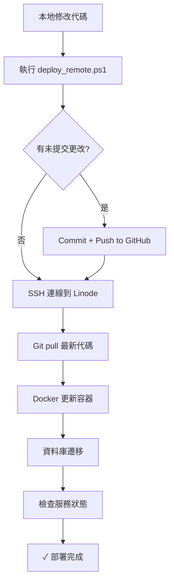

# SSH 自動部署設定指南

> **目標**：設定免密碼 SSH 登入，實現從本地一鍵部署到 Linode 伺服器

---

## 🚀 快速開始（3 步驟）

### 1️⃣ 設定 SSH 免密碼登入（僅需一次）
在 **本地 PowerShell** 執行：
```powershell
cd C:\Users\User\Desktop\aihr
.\scripts\setup_ssh_key.ps1
```

**會提示輸入伺服器密碼（僅此一次）**  
完成後，未來所有 SSH 連線都不再需要密碼。

---

### 2️⃣ 初始部署（首次需要在伺服器上執行）
第一次部署需要在伺服器上設定環境：

```powershell
# 免密碼登入到伺服器
ssh aihr-linode

# 執行初始部署
cd /opt
git clone https://github.com/stevechen1112/aihr.git
cd aihr
bash scripts/deploy_linode.sh
```

**手動填寫必填項目**（API keys、超級管理員帳號等）

---

### 3️⃣ 之後的更新部署（本地一鍵）
在 **本地 PowerShell** 執行：
```powershell
cd C:\Users\User\Desktop\aihr
.\scripts\deploy_remote.ps1
```

**完成！** 腳本會自動：
- 推送本地更改到 GitHub
- SSH 連線到 Linode 伺服器
- 拉取最新代碼
- 更新 Docker 容器
- 執行資料庫遷移
- 驗證服務狀態

---

## 📋 詳細步驟說明

### 步驟 1：SSH 密鑰設定

#### 執行腳本
```powershell
.\scripts\setup_ssh_key.ps1
```

#### 腳本會做什麼？
1. ✅ 檢查/創建 `~/.ssh` 目錄
2. ✅ 生成 SSH 密鑰對（`id_rsa_linode` / `id_rsa_linode.pub`）
3. ✅ 上傳公鑰到伺服器（需輸入密碼一次）
4. ✅ 配置 SSH config 檔案（別名：`aihr-linode`）
5. ✅ 測試免密碼登入

#### 完成後可用的登入方式
```powershell
# 方式 1：使用別名（推薦）
ssh aihr-linode

# 方式 2：完整路徑
ssh -i ~/.ssh/id_rsa_linode root@172.237.11.179
```

---

### 步驟 2：初始部署

> **注意**：初始部署需要在伺服器上執行，之後才能使用本地一鍵部署

#### 2.1 登入伺服器
```powershell
ssh aihr-linode
```

#### 2.2 克隆專案
```bash
cd /opt
git clone https://github.com/stevechen1112/aihr.git
cd aihr
```

#### 2.3 執行初始部署腳本
```bash
bash scripts/deploy_linode.sh
```

#### 2.4 手動填寫必填環境變數
腳本會暫停，提示你編輯 `.env.production`：
```bash
vim .env.production
```

必填項目：
```bash
# API Keys
OPENAI_API_KEY=sk-proj-...
VOYAGE_API_KEY=pa-...
LLAMAPARSE_API_KEY=llx-...

# 超級管理員
FIRST_SUPERUSER_EMAIL=admin@yourdomain.com
FIRST_SUPERUSER_PASSWORD=<強隨機密碼>

# 網域（已自動設定為 sslip.io）
BACKEND_CORS_ORIGINS=http://app.172-237-11-179.sslip.io,http://admin.172-237-11-179.sslip.io
FRONTEND_URL=http://app.172-237-11-179.sslip.io
ADMIN_FRONTEND_URL=http://admin.172-237-11-179.sslip.io
```

填寫完後按 Enter 繼續，腳本會自動完成剩餘步驟。

#### 2.5 驗證部署
```bash
bash scripts/verify_deployment.sh
```

---

### 步驟 3：本地一鍵部署

完成初始部署後，所有未來的更新都可以在本地一鍵完成！

#### 基本用法
```powershell
# 標準部署（增量更新）
.\scripts\deploy_remote.ps1

# 跳過 Git push（如果你已經手動推送）
.\scripts\deploy_remote.ps1 -SkipGitPush

# 僅重啟服務（不更新代碼）
.\scripts\deploy_remote.ps1 -RestartOnly

# 完整部署（重建所有容器）
.\scripts\deploy_remote.ps1 -FullDeploy
```

#### 標準部署流程
當你執行 `.\scripts\deploy_remote.ps1` 時：

1. **檢查本地更改**
   - 如果有未提交的更改，會詢問是否要 commit + push
   - 你可以輸入 commit 訊息（或使用預設時間戳）

2. **推送到 GitHub**
   ```
   git add -A
   git commit -m "Deploy: 2026-02-11 15:30:00"
   git push origin main
   ```

3. **SSH 連線到伺服器**（免密碼！）

4. **遠端執行部署**
   ```bash
   cd /opt/aihr
   git pull                                          # 拉取最新代碼
   docker compose -f docker-compose.prod.yml up -d --build  # 更新容器
   alembic upgrade head                              # 資料庫遷移
   ```

5. **顯示部署結果** ✅

#### 範例輸出
```
=========================================
UniHR SaaS - 遠端部署工具
=========================================

[15:30:01] 測試 SSH 連線...
✓ SSH 連線正常
[15:30:02] 檢查 Git 狀態...
✓ 沒有未提交的更改
[15:30:03] 執行遠端部署...

模式: 標準部署（增量更新）

=========================================
開始部署...
=========================================
[1/5] 拉取最新代碼...
✓ 代碼已更新
[2/5] 檢查環境配置...
✓ 環境配置存在
[3/5] 更新並重啟服務...
✓ 服務已更新
[4/5] 執行資料庫遷移...
✓ 資料庫遷移完成
[5/5] 檢查服務狀態...
NAME                STATUS        PORTS
aihr-web-1          Up (healthy)  0.0.0.0:8000->8000/tcp
aihr-worker-1       Up
aihr-postgres-1     Up (healthy)
aihr-redis-1        Up (healthy)
aihr-gateway-1      Up            0.0.0.0:80->80/tcp

=========================================
✓ 部署完成！
=========================================

服務地址：
  - 使用者介面: http://app.172-237-11-179.sslip.io
  - 系統方介面: http://admin.172-237-11-179.sslip.io
  - API 文件: http://api.172-237-11-179.sslip.io/docs

=========================================
✓✓✓ 部署成功！✓✓✓
=========================================
```

---

## 🛠️ 進階用法

### 遠端查看日誌
```powershell
# 所有服務日誌
ssh aihr-linode "cd /opt/aihr && docker compose -f docker-compose.prod.yml logs -f"

# 特定服務日誌
ssh aihr-linode "cd /opt/aihr && docker compose -f docker-compose.prod.yml logs -f web"
```

### 遠端執行命令
```powershell
# 檢查服務狀態
ssh aihr-linode "cd /opt/aihr && docker compose -f docker-compose.prod.yml ps"

# 執行驗證腳本
ssh aihr-linode "cd /opt/aihr && bash scripts/verify_deployment.sh"

# 重啟特定服務
ssh aihr-linode "cd /opt/aihr && docker compose -f docker-compose.prod.yml restart web"
```

### 快速別名（可選）
在 PowerShell Profile 中加入別名：
```powershell
# 編輯 Profile
notepad $PROFILE

# 加入以下內容
function Deploy-AIHR { cd C:\Users\User\Desktop\aihr; .\scripts\deploy_remote.ps1 }
Set-Alias deploy Deploy-AIHR

# 之後只需要執行
deploy
```

---

## 🔧 故障排除

### 問題 1: SSH 連線失敗
```powershell
# 測試連線
ssh -v aihr-linode

# 檢查密鑰權限
ls -l ~/.ssh/id_rsa_linode

# 重新設定 SSH
.\scripts\setup_ssh_key.ps1
```

### 問題 2: Git push 失敗
```powershell
# 檢查 GitHub 認證
git remote -v
git config --list | grep user

# 手動推送
git push origin main
```

### 問題 3: 部署腳本執行失敗
```powershell
# 查看遠端日誌
ssh aihr-linode "cd /opt/aihr && docker compose -f docker-compose.prod.yml logs --tail=100"

# 手動登入除錯
ssh aihr-linode
cd /opt/aihr
docker compose -f docker-compose.prod.yml ps
```

### 問題 4: .env.production 不存在
```powershell
# 遠端生成環境配置
ssh aihr-linode "cd /opt/aihr && python3 scripts/generate_secrets.py --output .env.production"

# 手動編輯
ssh aihr-linode "vim /opt/aihr/.env.production"
```

---

## 📦 檔案結構

```
aihr/
├── scripts/
│   ├── setup_ssh_key.ps1       # SSH 免密碼設定腳本（本地執行）
│   ├── deploy_remote.ps1       # 一鍵部署腳本（本地執行）
│   ├── deploy_linode.sh        # 初始部署腳本（伺服器執行）
│   └── verify_deployment.sh    # 驗證腳本（伺服器執行）
└── docs/
    ├── SSH_AUTO_DEPLOY.md      # 本文件
    ├── LINODE_DEPLOYMENT.md    # 完整部署指南
    └── LINODE_QUICKSTART.md    # 快速參考
```

---

## 🔐 安全注意事項

1. **私鑰保護**
   - SSH 私鑰 (`~/.ssh/id_rsa_linode`) 不會被 commit 到 Git
   - 請妥善保管，不要分享給他人

2. **.env.production 保護**
   - 包含 API keys 和敏感資料
   - 已在 `.gitignore` 中排除
   - 僅存在於伺服器上

3. **GitHub 權限**
   - 確保你的 GitHub 帳號有 push 權限
   - 建議使用 Personal Access Token 而非密碼

---

## 🎯 完整工作流程



---

## 📞 需要協助？

- **GitHub Issues**: https://github.com/stevechen1112/aihr/issues
- **完整文檔**: [docs/LINODE_DEPLOYMENT.md](./LINODE_DEPLOYMENT.md)
- **快速參考**: [docs/LINODE_QUICKSTART.md](./LINODE_QUICKSTART.md)
